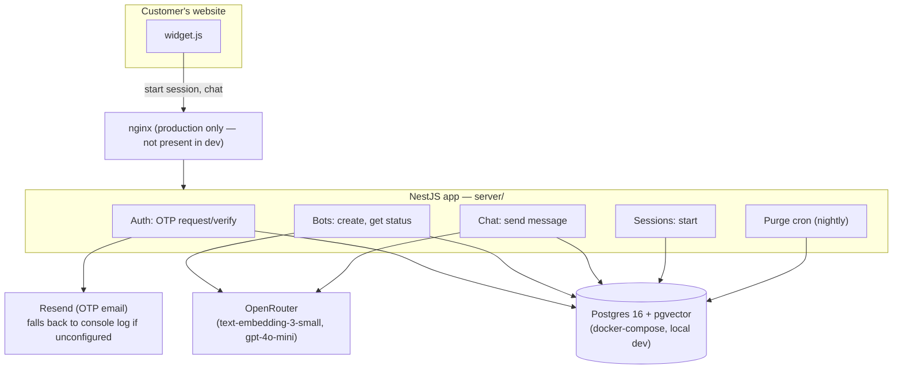

# Resolve RAG — Architecture & Implementation Reference

Status: reflects the Trial-plan MVP built in `server/`, verified end-to-end
against real Postgres/pgvector and real OpenRouter calls. The original
Express app in `src/` is untouched and still runs independently — nothing
has been cut over yet.

Related documents, not duplicated here:
- [docs/system-design-mvp.md](docs/system-design-mvp.md) — the target design across Trial/Instant/Business, written before implementation
- [docs/coding_standards.md](docs/coding_standards.md) — the Clean Architecture reference this implementation follows
- [docs/industries.md](docs/industries.md) — the vertical cost-model business case referenced in the fallback design

---

## 1. System architecture overview and data flow

### 1.1 Two systems currently coexist

| | Legacy (`src/`) | New (`server/`) |
|---|---|---|
| Stack | Plain Express, no TypeScript | NestJS, TypeScript, Clean Architecture |
| Bot metadata | SQLite (`data/resolve.db`) | Postgres |
| Vectors | Flat JSON per bot (`data/vectors/{botId}.json`) | pgvector (`chunks` table) |
| Auth | None — `botId` is the only access control | OTP email verification, embed tokens, session tokens |
| Conversation log | None | `sessions` + `messages` tables |
| Data retention | None | 15-day hard-purge cron for trial bots |
| Status | Still running, untouched | New, not yet cut over |

They are independent processes with independent ports and independent data
stores. The only shared artifact is `public/widget.js`, which has been
updated to the new server's API contract — see §5's limitations for what
that means for the legacy app.

### 1.2 Component diagram



### 1.3 Data flow — bot creation

```
Admin → POST /auth/otp/request {email}
      → (Resend, or console log if RESEND_API_KEY unset) → 6-digit code
Admin → POST /auth/otp/verify {email, code}
      → verification JWT (30 min TTL, purpose=bot-creation)
Admin → POST /bots {verificationToken, companyName, pdf?/websiteUrl?/description?}
      → extract PDF text / scrape website (≤10 pages) / use description
      → chunk (500 chars, 50 overlap) → embed via OpenRouter
      → INSERT bots + chunks in one transaction
      → embedToken (returned once), widgetSnippet, previewUrl
```

### 1.4 Data flow — chat

```
Visitor → POST /bots/:botId/session (X-Embed-Token, Origin)
        → EmbedTokenGuard, OriginCheckGuard
        → sessionToken (24h TTL, purpose=chat-session)
Visitor → POST /bots/:botId/chat (X-Embed-Token, Authorization: Bearer <sessionToken>)
        → EmbedTokenGuard, OriginCheckGuard, SessionTokenGuard, RateLimitGuard
        → trial gates (expiresAt, tokenUsage) checked in SendMessage
        → embed query → pgvector top-4 similarity search
        → Tier 1: best score < 0.3 → fallback, no LLM call
        → Tier 2: LLM called, self-reports {answered, text} → fallback if answered=false
        → { type: "answer", answer } or { type: "fallback", fallback: {message, contactEmail} }
```

---

## 2. Features implemented, with file locations

All paths below are relative to the repo root; `server/src/...` unless noted.

### 2.1 Passwordless admin authentication (OTP)
- `core/usecases/commands/RequestOtp.ts`, `core/usecases/commands/VerifyOtp.ts`
- `core/entities/AdminUser.ts`, `core/entitygateway/AdminUser.ts`
- `infrastructure/SequelizePersistence/models/AdminUserModel.ts`, `admin-user-persistence.service.ts`
- `infrastructure/SequelizePersistence/migrations/20260401000001-create-admin-users.js`
- `infrastructure/Email/resend-email.service.ts` — sends via Resend, or logs the code to console if `RESEND_API_KEY` is unset (dev convenience)
- `infrastructure/Auth/jwt.util.ts`, `infrastructure/Auth/token-service.service.ts` (`TokenService` port + adapter)
- `infrastructure/Auth/guards/verification-token.guard.ts`
- `gateways/http/auth.controller.ts`, `gateways/http/dto/RequestOtpDTO.ts`, `VerifyOtpDTO.ts`
- 6-digit code, bcrypt-hashed, 10-minute expiry, 5 max attempts, 60-second resend cooldown (`core/constants.ts`)

### 2.2 Bot creation (PDF / website / description ingestion)
- `core/usecases/commands/CreateBot.ts` — orchestrates extraction, chunking, embedding, persistence
- `core/usecases/services/chunking.service.ts` — 500-char chunks, 50-char overlap, ported from the legacy chunker
- `infrastructure/Ingestion/pdf-extraction.service.ts` — wraps `pdf-parse` (pinned to v1.1.1 — see §3)
- `infrastructure/Ingestion/scraping.service.ts` — same-origin BFS crawl, ≤10 pages, ported from legacy `src/rag/scrape.js`
- `infrastructure/LLM/open-router.service.ts` — embeddings (`text-embedding-3-small`, batches of 100) and chat completion (`gpt-4o-mini`)
- `gateways/http/bots.controller.ts` (`POST /bots`), `dto/CreateBotDTO.ts`, `validators/IsValidWebsiteUrl.ts`
- PDF capped at 10MB (Multer, in-memory), website scraping capped at 10 pages, 200k char ingestion ceiling

### 2.3 Embed-token + Origin-protected bot access
- `infrastructure/Auth/guards/embed-token.guard.ts` — `X-Embed-Token` header vs `bot.embedToken`, `crypto.timingSafeEqual`
- `infrastructure/Auth/guards/origin-check.guard.ts` — `Origin`/`Referer` hostname vs `bot.websiteUrl` hostname (no-op for PDF-only bots)
- Embed token generated in `core/usecases/services/token.service.ts::generateEmbedToken()`, returned exactly once from `CreateBot`

### 2.4 pgvector retrieval + two-tier confidence-gated fallback
- `infrastructure/SequelizePersistence/chunk-persistence.service.ts` — raw SQL (no Sequelize model — see §3), `<=>` cosine-distance operator
- `infrastructure/SequelizePersistence/migrations/20260401000003-enable-pgvector-and-create-chunks.js`
- `core/usecases/commands/SendMessage.ts` — Tier 1 (retrieval-confidence gate, `RETRIEVAL_CONFIDENCE_THRESHOLD = 0.3`) and Tier 2 (LLM self-report `{answered, text}`)
- `gateways/http/chat.controller.ts` (`POST /bots/:botId/chat`), `dto/SendMessageDTO.ts`
- Per-bot configurable `fallbackMessage`/`contactEmail` (set at creation, defaults to admin's signup email)

### 2.5 Signed per-visitor sessions
- `core/usecases/commands/StartSession.ts`
- `core/entities/Session.ts`, `core/entitygateway/Session.ts`
- `infrastructure/SequelizePersistence/models/SessionModel.ts`, `session-persistence.service.ts`
- `infrastructure/SequelizePersistence/migrations/20260401000004-create-sessions.js`
- `infrastructure/Auth/guards/session-token.guard.ts` — verifies JWT + recomputes `sha256(token)` against the stored `tokenHash` (lets a session be revoked server-side without a JWT blacklist)
- `gateways/http/sessions.controller.ts` (`POST /bots/:botId/session`)

### 2.6 Conversation logging
- `core/entities/Message.ts`, `core/entitygateway/Message.ts`
- `infrastructure/SequelizePersistence/models/MessageModel.ts`, `message-persistence.service.ts`
- `infrastructure/SequelizePersistence/migrations/20260401000005-create-messages.js`
- Every visitor message and bot/fallback response persisted; `getMessagesBySessionId` defined but not yet used by any route (ready for a future transcript view)

### 2.7 Rate limiting (dual layer)
- `infrastructure/RateLimit/rate-limit.guard.ts` — per-IP-per-bot-per-day cap (15/day default, `DAILY_LIMIT` env override), IP whitelist (`WHITELISTED_IPS`), trial-plan only
- `core/entitygateway/DailyUsage.ts`, `infrastructure/SequelizePersistence/daily-usage-persistence.service.ts` — raw SQL (no Sequelize model — see §3)
- `infrastructure/SequelizePersistence/migrations/20260401000006-create-daily-usage.js`

### 2.8 Trial lifecycle gates
- Enforced in `core/usecases/commands/StartSession.ts` and `SendMessage.ts`: 30-day access window (`TrialExpiredError`, 402), 50,000-token allowance (`TrialTokenLimitExceededError`, 402)
- Token usage incremented only when the LLM is actually called (`bot-persistence.service.ts::incrementTokenUsage`)

### 2.9 Retention lead capture
- `core/entities/RetentionLead.ts`, `core/entitygateway/RetentionLead.ts`
- `infrastructure/SequelizePersistence/models/RetentionLeadModel.ts`, `retention-lead-persistence.service.ts`
- `infrastructure/SequelizePersistence/migrations/20260401000007-create-retention-leads.js`
- Captured in `core/usecases/commands/RequestOtp.ts` at OTP-request time — **no foreign key to Bot**, by design, so it survives the trial hard-purge

### 2.10 Nightly trial data purge
- `core/usecases/commands/PurgeExpiredTrials.ts` — deletes bots older than 15 days (`TRIAL_HARD_DELETE_DAYS`); relies on `ON DELETE CASCADE` (sessions → messages, chunks) rather than an application-level transaction
- `infrastructure/Cron/purge-cron.service.ts`, `infrastructure/Cron/cron.module.ts` — `@nestjs/schedule`, `0 3 * * *`

### 2.11 Bot status endpoint
- `core/usecases/queries/GetBotStatus.ts` — strips `embedToken` before returning
- `gateways/http/bots.controller.ts` (`GET /bots/:botId`) — public, no auth (matches legacy's "botId is not sensitive once embedToken is removed")

### 2.12 API documentation
- `gateways/http/swagger/swagger.setup.ts` — three security schemes registered (`verification-token`, `session-token`, `embed-token`)
- Full `@ApiOperation`/`@ApiResponse`/`@ApiParam` coverage on every controller method
- Served at `/api/docs` (UI) and `/api/docs-json` (raw spec)

### 2.13 Static widget hosting
- `app.module.ts` — `ServeStaticModule` serves the repo's top-level `public/` directory under `/widget` on the new server too (added because `CreateBot`'s generated `widgetSnippet`/`previewUrl` depend on it — see §3)

### 2.14 Widget (embed script)
- `public/widget.js` — updated in place (shared file, see §5): reads `data-embed-token`, calls `POST /session` on load, calls `POST /chat` with `X-Embed-Token` + `Authorization: Bearer <sessionToken>`, renders `type: "answer"` vs `type: "fallback"` distinctly, retries once on 401, disables input on 402/429

---

## 3. Technical decisions made, and why

| Decision | Why |
|---|---|
| NestJS Clean Architecture (entities / entitygateway / usecases / infrastructure / coreadapter) | Explicit requirement — the whole rewrite exists to bring this codebase onto the team's standard, per `docs/coding_standards.md` |
| Postgres + pgvector, not a separate vector DB | At trial scale (a few hundred chunks/bot), brute-force `<=>` scan is fast enough; one datastore means one backup story and transactional consistency between bot and chunk data |
| Raw SQL for `Chunk` (no Sequelize model) | Sequelize has no `vector` column type — `ChunkRow.ts` is a plain type, not a `@Table` model; every method still returns entity shapes so callers can't tell the difference |
| Raw SQL for `DailyUsage` (no Sequelize model) | Composite-key atomic increment (`ON CONFLICT ... DO UPDATE SET message_count = message_count + 1`) needs raw SQL — a model-based `upsert()` would overwrite the counter instead of incrementing it |
| `TransactionManager` port used only in `CreateBot`, not in `PurgeExpiredTrials` | Bot+chunk creation genuinely needs atomicity (a partial chunk insert must not leave an orphaned bot); the purge job doesn't — a single `DELETE` with `ON DELETE CASCADE` is already atomic per bot, so adding transaction machinery there would be unused complexity. This was a correction made to the original implementation plan before building. |
| Four narrow method-level guards instead of one class-level `JwtAuthGuard` stack | Trial has no persistent login (verification is one-shot) — the coding standard's reference pattern assumes every endpoint sits behind a logged-in user, which doesn't apply here. `passport`/`passport-jwt` are installed but unused, reserved for the Instant plan's dashboard login |
| `TokenService` port added (not in the original plan) | The approved implementation plan had `VerifyOtp`/`StartSession` (core use cases) call `infrastructure/Auth/jwt.util.ts` directly — a Clean Architecture violation (core importing infrastructure). Added a `TokenService` port + `JwtTokenService` adapter so signing goes through a port; verification stays in guards (already infrastructure, no purity constraint there) |
| `RETRIEVAL_CONFIDENCE_THRESHOLD = 0.3`, not the originally-proposed `0.75` | Live-calibrated against real `text-embedding-3-small` scores during verification: clearly in-scope questions scored 0.42–0.64 cosine similarity, clearly out-of-scope scored 0.04–0.14. The original 0.75 would have rejected nearly every legitimate answer — caught by actually testing, not by inspection |
| `pdf-parse` pinned to `1.1.1`, not latest | `npm install pdf-parse` defaulted to v2.4.5, which has a completely different (class-based) API. v1.1.1 matches what the legacy app already uses and what the extraction service was written against |
| `otpLastSentAt` left untouched by `VerifyOtp` | Originally cleared on successful verification, which let the resend cooldown be bypassed immediately after verifying — found and fixed during testing |
| `.prettierrc` corrected to `{semi: false, arrowParens: "avoid", trailingComma: "es5"}` | `nest new` scaffolds its own defaults (`trailingComma: "all"`, semicolons on), which don't match `coding_standards.md` §7.1. Running `npm run lint` (which includes `--fix`) had silently reformatted the whole codebase to the wrong style before this was caught |
| `ServeStaticModule` added for `/widget` | Not in the original plan's file tree — added because `CreateBot`'s `widgetSnippet`/`previewUrl` point at `{WIDGET_HOST_URL}/widget.js`, which nothing served on the new app until this was added |
| Local dev Postgres via Docker Compose on port 5434 | Port 5433 was already occupied by an unrelated project's Postgres container (`zaadi_postgres`) on this machine — 5434 avoids the collision |

---

## 4. State management and API structures

### 4.1 Core entities (`core/entities/`)

```
AdminUser        id, email, verifiedAt?, otpCodeHash?, otpExpiresAt?, otpAttempts,
                 otpLastSentAt?, role, createdAt, updatedAt
Bot              id, adminUserId, companyName, businessType?, websiteUrl?, description?,
                 plan, embedToken, status, chunkCount, tokenUsage, tokenLimit?,
                 expiresAt?, fallbackMessage?, contactEmail, createdAt, updatedAt
Chunk            id, botId, text, embedding (number[], 1536-dim), createdAt
Session          id, botId, tokenHash, status, ipAddress, userAgent?,
                 createdAt, lastActivityAt, updatedAt
Message          id, sessionId, role (visitor|bot|human_agent), content, createdAt
RetentionLead    id, email, companyName?, plan, capturedAt, lastActiveAt,
                 createdAt, updatedAt   — no FK to Bot, by design
DailyUsage       ipAddress, botId, date, messageCount   — composite key, no synthetic id
```

`BotPublic = Omit<Bot, 'embedToken'>`, `AdminUserPublic = Omit<AdminUser, 'otpCodeHash'>` — the sensitive fields are stripped at the type level before anything leaves a query.

### 4.2 Dependency injection — the `Deps` object

Every use case is a factory function `makeUC(deps: Deps)` returning the actual handler. `Deps` (`core/entitygateway/index.ts`) is the single interface listing every port a use case might need: `logger`, `emailService`, `tokenService`, `{admin,bot,chunk,session,message,dailyUsage,retentionLead}Loader/Persistor`, `llmService`, `scrapingService`, `pdfExtractionService`, `transactionManager`. `coreadapter/coreadapter.service.ts` is the single place that wires concrete infrastructure classes into this object and calls `initUseCases(deps)`.

### 4.3 Token types (three, deliberately not interchangeable)

| Token | Issued by | TTL | Carries | Checked by |
|---|---|---|---|---|
| Verification token | `VerifyOtp` | 30 min | `adminUserId`, `email`, `purpose: 'bot-creation'` | `VerificationTokenGuard` |
| Session token | `StartSession` | 24h | `botId`, `sessionId`, `purpose: 'chat-session'` | `SessionTokenGuard` (+ hash check against `sessions.tokenHash`) |
| Embed token | `CreateBot` (random, not a JWT) | none (long-lived) | — compared directly via `timingSafeEqual` | `EmbedTokenGuard` |

All JWTs share one secret (`AUTH_JWT_SECRET`); the `purpose` claim is what stops a verification token being replayed as a session token or vice versa.

### 4.4 API surface

```
POST /api/v1/auth/otp/request    {email}                                  → {message}
POST /api/v1/auth/otp/verify     {email, code}                            → {message, data:{verificationToken, expiresIn}}
POST /api/v1/bots                multipart: companyName, businessType?,
                                  websiteUrl?, description?, pdf?,
                                  fallbackMessage?, contactEmail?          → {message, data:{botId, embedToken, widgetSnippet, previewUrl, chunkCount, pagesScraped?}}
GET  /api/v1/bots/:botId                                                  → BotStatusResponseDTO (no embedToken)
POST /api/v1/bots/:botId/session                                          → {message, data:{sessionId, sessionToken, expiresIn}}
POST /api/v1/bots/:botId/chat    {message}                                → {type:"answer", answer, sessionId} | {type:"fallback", fallback:{message, contactEmail}, sessionId}
```

Error shape (via `HandleRagErrors` decorator, `shared/decorators/handle-rag-errors.decorator.ts`): `{ error: errorCode, message, ...details }`, matching what the legacy app and widget already expected for 402/429 responses.

### 4.5 Configuration (`server/.env`)

`PORT`, `DATABASE_URL`, `OPENROUTER_API_KEY`, `RESEND_API_KEY`, `EMAIL_FROM`, `AUTH_JWT_SECRET`, `WIDGET_HOST_URL` — plus legacy-compatible `WHITELISTED_IPS`/`DAILY_LIMIT` read directly by `rate-limit.guard.ts`. All trial-plan numeric limits live in `core/constants.ts`, not scattered across files.

---

## 5. Known limitations and Phase 2 next steps

### Carried over from `docs/system-design-mvp.md` (not built yet — explicitly out of scope for this pass)
- **Instant plan**: JWT dashboard login (`passport`/`passport-jwt` installed but unused), session-list/transcript UI, no trial gates + soft circuit-breaker cap (open question — see the design doc's Open Items)
- **WhatsApp two-way handoff**: `SessionStatus` already includes `needs_human`/`human_active` values, `MessageRole` already includes `human_agent`, but no `WhatsAppLink` entity, no webhook receiver, no bridge logic exists yet
- **Business plan**: `IntegrationConfig`/`CallCustomerApi` — not started, intentionally deferred

### Gaps specific to this implementation
- **No automated test suite** — verification was done via live curl/Puppeteer runs against a real dev database and real OpenRouter, not unit/e2e tests. `jest`/`supertest` are installed (Nest scaffold defaults) but no test files were written.
- **`public/widget.js` is shared** between the old Express app and the new server, and now only matches the new server's API contract. The old app's own trial bots (if any still exist against `data/resolve.db`) would be served an incompatible widget until cutover.
- **Production Postgres not provisioned** — local dev only runs against the `docker-compose.yml` pgvector container. The Neon connection for production is not yet set up (see `docs/system-design-mvp.md` §1 for the recommendation).
- **No IVFFlat/HNSW index on `chunks`** — deliberate at this scale (brute-force `<=>` scan is fast for a few hundred rows per bot); revisit if a single bot's chunk count grows into the tens of thousands.
- **Concurrent WhatsApp handoff threading** (Instant, not built) — the design doc already flags that routing a raw WhatsApp reply to "the admin's most-recently-opened session" breaks down with concurrent handoffs; needs a decision before that phase starts.
- **Guided content-intake fields** (hours/pricing/policies at signup, to improve Trial's answer coverage for the industries.md verticals) — proposed as optional in the design doc, not implemented.
- **Retrieval-confidence threshold (0.3) and default fallback wording** are calibrated against one test bot's content in one domain (a dental clinic / cafe). Worth re-checking against a wider variety of real trial content once available.
- **No admin-facing bot list** — `listBots()`-equivalent was never built for the new server (the legacy app had the same gap); there's no way to enumerate a given admin's bots via the API yet.
- **Widget transcript/history** — `MessageLoader.getMessagesBySessionId` exists but nothing calls it; a page reload loses visible chat history (though the session token and server-side messages persist).
