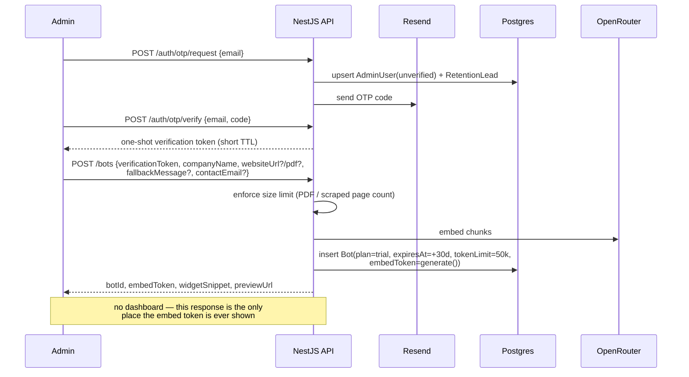
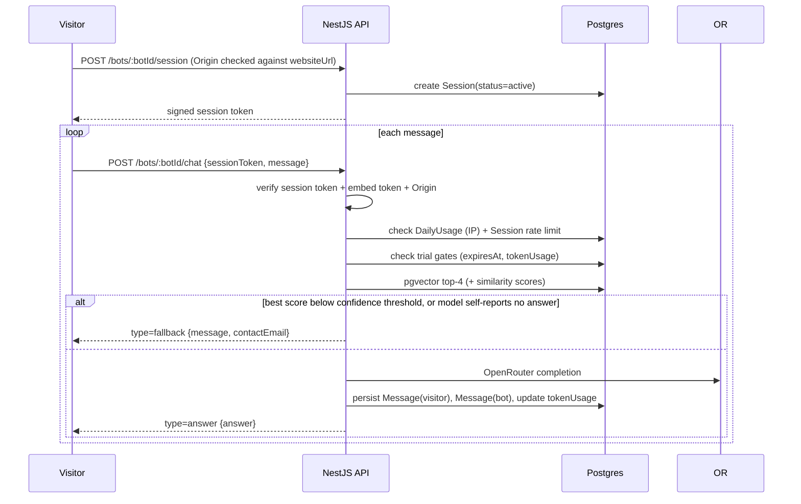
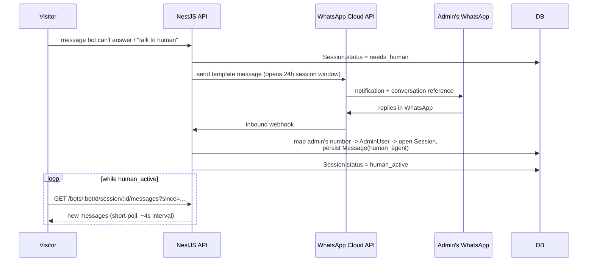
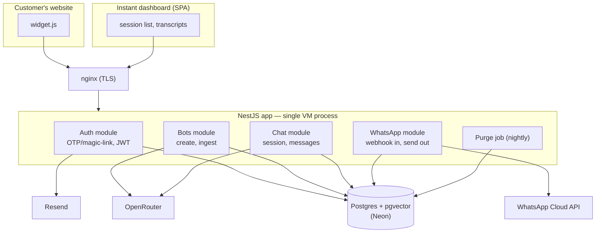

# Resolve RAG — System Design & MVP Plan

Status: proposed, not yet implemented. Target architecture uses the stack and
conventions in [coding_standards.md](./coding_standards.md) (NestJS Clean
Architecture, Postgres, Sequelize, JWT, Swagger), Postgres+pgvector for
embeddings, Resend for transactional email, and stays on a single VM (no
containers/serverless).

Decisions below reflect answers already given for this round:
- Trial: creation is gated behind email verification, and the chat endpoint
  is protected beyond botId (not just gated at signup).
- Trial data: **hard cutoff** — bot, sessions, vectors are fully deleted
  after 15 days. Retention outreach relies only on the email captured at
  signup, decoupled from that deletion.
- Instant WhatsApp handoff: **two-way bridge** — human replies from WhatsApp
  flow back into the same widget session.
- Instant anti-misuse: signed per-session token + rate limiting, no CAPTCHA.

---

## 1. Plan tiers

| | **Trial** | **Instant** | **Business** *(future — context only)* |
|---|---|---|---|
| Signup | Email (OTP-verified) → website/PDF | Same, plus becomes a persistent dashboard account | Same as Instant |
| Dashboard | None | Yes — session list, bot status | Same as Instant + API/integration config |
| Content sources | PDF (size-capped) or website | Same | Same |
| Chat volume | Capped: 30-day expiry, 50k token allowance, daily per-IP/session rate limit | Unlimited (still rate-limited for abuse, not for cost-capping) | Same as Instant |
| Human handoff | None | WhatsApp, two-way bridge, one number per account | Same, plus custom API/software integrations |
| Fallback on unanswerable query | Configurable "contact us" message + email (§6) | Same, + WhatsApp handoff (deferred, §5) | Same, or resolved directly via live API integration |
| Data retention | Hard-deleted after 15 days (bot, sessions, vectors); signup email kept separately for retention email | Retained indefinitely (paying-adjacent) | Retained indefinitely |
| End-visitor identity | Signed session token, no login | Signed session token, no login | Signed session token, no login |

Business plan is explicitly deferred — see [§8](#8-business-plan-future-placeholder-only).

---

## 2. User & auth model

Three distinct identities, all passwordless (email OTP / magic link via
Resend) — no passwords anywhere in this system:

1. **AdminUser** — the company contact. Created at signup for every plan.
   - Trial: verification is one-shot — OTP confirms the email, unlocks the
     creation flow, and no persistent login session is issued (there's no
     dashboard to return to).
   - Instant: same OTP/magic-link flow, but successful verification issues a
     JWT dashboard session (short-lived, re-issued via a fresh magic link on
     expiry — no refresh-token complexity needed at this scale).

2. **End-visitor session** — anonymous site visitors chatting with the
   widget. No login. On first load, `widget.js` requests a signed session
   token scoped to `{botId, sessionId}`; every subsequent `/api/chat` call
   carries it. This token is what session data (§4) hangs off, and it's the
   primary anti-misuse control for Instant (rate-limited per session, not
   just per IP — clearing storage gets a new session but not a new IP, so
   the existing per-IP-per-day cap still catches churn abuse).

3. **Bot embed protection** — be precise about what "protected by
   authentication" can mean for a public `<script>` embed: nothing shipped
   to the browser can be a true secret. What we actually get:
   - An **embed token** issued at bot creation, sent with every chat call
     instead of relying on `botId` alone — raises the bar from "guess a
     UUID" to "guess a UUID + a second unguessable value," and lets us
     revoke/rotate a specific bot's access without touching others.
   - **Origin/Referer allowlisting** against the bot's registered
     `websiteUrl` when one was provided at creation — rejects calls that
     don't originate from the customer's own site.
   - The **end-visitor session token** above is the layer that actually
     stops scripted abuse (rate limiting is per-session, not just per
     embed token, which is visible in page source).

   None of this makes the endpoint truly private — it can't be, it's called
   from arbitrary customer websites by design — but it closes the gap from
   "anyone who finds a botId can hit it indefinitely" to "requests must
   originate from the right site and are rate-limited per visitor."

---

## 3. Core entities

```
AdminUser        id, email, verifiedAt, role, createdAt
Bot              id, adminUserId, companyName, businessType, websiteUrl,
                 plan[trial|instant|business], embedToken, status,
                 chunkCount, tokenUsage, tokenLimit, expiresAt,
                 fallbackMessage, contactEmail, createdAt
Chunk            id, botId, text, embedding vector(1536), createdAt
Session          id, botId, tokenHash, status[active|needs_human|
                 human_active|closed], ipAddress, userAgent, createdAt,
                 lastActivityAt
Message          id, sessionId, role[visitor|bot|human_agent], content,
                 createdAt
WhatsAppLink     adminUserId, phoneNumberId, wabaId, verifiedAt   (Instant+)
RetentionLead    email, companyName, plan, capturedAt, lastActiveAt
DailyUsage       ipAddress, botId, date, messageCount   (coarse, unchanged)
```

`RetentionLead` is deliberately **not** a foreign key off `Bot` — it's
written once at signup and never cascades when the trial data is
hard-deleted at day 15. That's the only thing that survives trial cleanup.

---

## 4. Trial plan — end-to-end flow





**Nightly purge job** (cron on the VM, not a queued service — volume doesn't
justify one yet): for every `Bot` where `createdAt < now - 15d` and
`plan = trial`, hard-delete `Bot`, its `Session`/`Message` rows, and its
`Chunk` rows in one transaction. `RetentionLead` is untouched — that's the
only record retention email can be built from post-purge.

> **Assumption to confirm:** the existing 30-day time gate / 50k token gate
> (what stops the bot answering) and the new 15-day hard-delete (what wipes
> the data) are treated here as two independent clocks — a trial bot can
> still be answering questions on day 20 even though its own conversation
> history from day 1–5 is already gone. If the intent was actually a single
> unified 15-day trial (shrinking the existing 30-day access window to
> match), that's a one-line config change, not an architecture change — flag
> if that's what you meant.

---

## 5. Instant plan — end-to-end flow

Builds on everything in Trial (same ingestion pipeline, same chat/session
mechanics) with three additions: a real dashboard login, no trial gates, and
WhatsApp handoff.

- **Dashboard access**: same OTP/magic-link email flow as Trial, but here it
  issues a JWT dashboard session. One `AdminUser` per Instant account — this
  is also the identity the WhatsApp number is linked to (there is no
  separate "WhatsApp user"; the admin *is* the WhatsApp-side identity).
- **Dashboard content (MVP)**: list of sessions for the bot (status, last
  activity, message count), and per-session transcript view. Bot
  re-ingestion (add more content) is a stretch goal, not required for MVP.
- **No trial gates**: `expiresAt`/`tokenLimit` are null for Instant bots —
  chat is only bounded by the anti-misuse rate limiter (§2.2), not by a
  cost cap. This is a real cost-exposure tradeoff worth flagging: "no limit"
  on an LLM-backed endpoint means a runaway/malicious session can generate
  real OpenRouter spend. Recommend keeping a *soft* per-session-per-day cap
  (generous, e.g. 200 messages) purely as a circuit breaker, distinct from
  the trial's *marketing* cap — confirm if that's acceptable or if "no
  limit" should be taken literally.

### WhatsApp two-way bridge



Two integration realities worth calling out now rather than discovering
mid-build:
1. **WhatsApp Business API requires a pre-approved template message** to
   open an outbound conversation — you can't freely message a number that
   hasn't messaged you first within 24h. The initial handoff notification
   must be a template, submitted to Meta for approval ahead of launch.
2. **Threading replies to the right session** is the real MVP risk: if an
   admin has more than one `needs_human` conversation open at once, a
   freeform WhatsApp reply has no built-in way to say which one it's
   answering. MVP-safe assumption: **route a reply to the admin's single
   most-recently-opened `needs_human`/`human_active` session** — correct
   for low concurrency, wrong the moment an admin is juggling two handoffs
   at once. If concurrent handoffs are expected from day one, the dashboard
   needs a proper inbox UI (reply *from* the dashboard, not raw WhatsApp)
   instead of relying on WhatsApp threading — worth a decision before this
   phase starts, not during it.
3. **Delivery back to the widget is polling, not push** (short-poll every
   ~4s while a session is in `needs_human`/`human_active`) — deliberate MVP
   simplification consistent with staying on a single VM with no new
   real-time infra. A WebSocket/SSE upgrade is a self-contained follow-up,
   not a redesign, once it's justified.

---

## 6. Fallback and out-of-scope handling

Every chat response — Trial, Instant, and Business alike — goes through the
same confidence gate before anything reaches the visitor. This is also the
mechanism that makes Trial usable for the verticals in
[industries.md](./industries.md) (retail, healthcare/clinics, HVAC,
hospitality) even though a website scrape can never capture the live data
(inventory, appointment slots, dispatch schedules) those businesses actually
need resolved — see [§8](#8-business-plan-future-placeholder-only) for why
that gap is the wedge for the Business tier, not a bug to hide.

### Detection — two tiers, the same approach production RAG assistants
(Intercom Fin and similar) use to avoid hallucinating rather than answering
anyway

1. **Retrieval-confidence gate** — pgvector returns similarity scores with
   its top-4 chunks. If the best score is below a fixed threshold (e.g.
   0.75, tunable, not exposed per-bot for MVP), the query is treated as
   out-of-scope *before* the LLM is called at all — cheaper, and avoids
   asking the model to improvise from irrelevant context. This is what
   catches "is this in stock" or "book me a table" on a bot whose only
   source is a static website — no chunk will score highly against a
   question about live state, so it falls back immediately instead of the
   LLM guessing at an answer.
2. **Generation-time self-report** — for queries that pass the confidence
   gate but where the retrieved context still doesn't actually answer the
   question, the system prompt requires the model to respond in a small
   structured shape (e.g. `{ "answered": boolean, "text": string }`)
   instead of free prose. When `answered: false`, the app substitutes the
   configured fallback message rather than showing the model's own "I
   don't know" wording — keeps the voice consistent and gives the app one
   reliable signal to act on, not string-matching model output.

Both tiers resolve to the same outcome: a structured `fallback` response,
never a raw apology or an exposed "we're not integrated with your system"
message. The end user only ever sees an on-brand "I don't have that
specific information — contact us at {contactEmail}," regardless of whether
the real reason was "not in the scraped content" or "requires a live system
this bot doesn't have access to." That distinction matters internally (it's
the signal a prospect needs the Business tier) but is never surfaced to
their customers.

### Admin configuration (bot setup page)

Two new optional fields on bot creation, alongside `companyName` /
`websiteUrl` / `pdf` / `description`:
- `fallbackMessage` — custom text, defaults to a generic template if unset
- `contactEmail` — defaults to the `AdminUser` signup email if unset

### Response contract

```
POST /bots/:botId/chat →
  { type: "answer", answer: string, sessionId }
  { type: "fallback", fallback: { message, contactEmail }, sessionId }
```

The `type` field is what the widget renders differently (a plain answer vs.
a "contact us" CTA), and it's the same signal Instant's `Session.status =
needs_human` / WhatsApp handoff (§5) hooks off — explicitly **not** wired up
yet per your instruction (Trial ships first), but the response contract is
designed so connecting it later is "call `RequestHumanHandoff` when
`type = fallback` on an Instant bot," not a rework of the chat endpoint.

### Making Trial's static content actually cover what these verticals ask

Per [industries.md](./industries.md), the highest-value questions in these
verticals split into two kinds: informational ("what's your HydraFacial
pricing," "what are your hours," "do you take walk-ins") and live-state
("is this in stock," "book me Saturday," "earliest technician slot"). Trial,
being website/PDF-only, can only ever resolve the first kind — but doing
that well is a real, honest "good chatbot" experience, not a stripped-down
demo. Recommend (optional, not a blocker for Phase 2) adding a few guided
intake fields at signup beyond the free-text `description` — hours,
address/phone, pricing/service list, key policies — so those high-frequency
informational questions reliably retrieve a strong match instead of
depending on whether the customer's website happens to state them clearly.
Live-state questions still correctly fall back to the contact CTA — that's
the intended boundary, not a gap to paper over.

---

## 7. Architecture



This maps directly onto the Clean Architecture layers in
[coding_standards.md](./coding_standards.md): `AdminUser`, `Bot`,
`Session`, `Message`, `WhatsAppLink`, `RetentionLead` are entities with
Loader/Persistor gateways; `OpenRouterService`, `ResendEmailService`,
`WhatsAppCloudService` are infrastructure adapters behind port interfaces;
use cases are `RequestOtp`, `VerifyOtp`, `CreateBot`, `StartSession`,
`SendMessage` (now includes the confidence-gate + fallback logic from §6),
`RequestHumanHandoff`, `ReceiveWhatsAppReply`, `PurgeExpiredTrials`.

---

## 8. Business plan — future placeholder only

Not designed in detail per your instruction — just the extension point so
Instant isn't built in a way that blocks it later: a `IntegrationConfig`
entity (`adminUserId`, `provider`, `credentials`, `createdAt`) and a
`CallCustomerApi` use case/infrastructure adapter, following the exact same
pattern as `WhatsAppCloudService`. Because the architecture is already
port/adapter-based, adding this later is a new module, not a rearchitecture.

This is specifically what closes the gap [§6](#6-fallback-and-out-of-scope-handling)
leaves open on purpose: per [industries.md](./industries.md), the cost gap
between a generic chatbot and Resolve comes from resolving live data —
checking stock, booking a specific appointment slot, dispatching a
technician — none of which a website/PDF knowledge base can ever answer.
Trial and Instant prove the assistant is good; Business is what lets it
actually resolve retail/healthcare/HVAC/hospitality's highest-value
questions instead of falling back on them.

---

## 9. Phased delivery

1. **Foundation** — NestJS skeleton per coding standards, Neon Postgres +
   pgvector, `AdminUser`/`Bot`/`Chunk` entities + migrations, Resend
   OTP service. No data migration from the current SQLite/JSON system —
   recreate trial bots by hand (data loss accepted).
2. **Trial plan, complete** — OTP-gated signup, ingestion pipeline with
   size limits, embed-token + Origin-checked chat endpoint, signed
   session tokens, dual rate limiting (session + IP), trial time/token
   gates, `RetentionLead` capture at signup, nightly hard-purge cron,
   confidence-gated fallback response with configurable message/contact
   email (§6). Optional: guided intake fields (hours, pricing, policies)
   to improve static content coverage for the industries.md verticals.
3. **Instant plan, complete** — JWT dashboard auth, session-list/transcript
   views, no trial gates (+ soft circuit-breaker cap, pending your
   confirmation in §5), WhatsApp Cloud API number linking, two-way bridge
   (webhook in, short-poll delivery out), fallback → `RequestHumanHandoff`
   wired up (deferred from Phase 2 per your instruction).
4. **Hardening** — background job/queue for scraping+embedding (so bot
   creation isn't a blocking HTTP request — website scraping is already the
   slowest step today), load-test the polling endpoint, Neon PITR verified,
   Swagger complete, secrets out of committed files.
5. **Business plan** — `IntegrationConfig` + `CallCustomerApi`, out of
   scope for now, listed for continuity only.

---

## Open items to confirm before Phase 2 starts

- PDF/website size limits: propose PDF ≤ 10MB (down from today's blanket
  20MB, trial-specific) and website scraping capped at N pages (today's
  scraper isn't capped — needs a number).
- Whether the 15-day purge and the 30-day access window are meant to be
  independent (as designed above) or should collapse into one 15-day trial.
- Whether Instant's "no limit" should get a soft circuit-breaker cap for
  cost protection, or is meant literally.
- Whether concurrent WhatsApp handoffs per admin are expected at launch —
  determines whether MVP's "most-recent-session" threading is acceptable or
  a dashboard-based reply UI is needed from day one.
- Retrieval-confidence threshold (proposed 0.75) and the default fallback
  message wording — confirm before Phase 2 so the intake form and the
  gating logic agree on defaults.
- Whether the guided intake fields (hours/pricing/policies) ship in Phase 2
  or are deferred — flagged as "good to have," not required.
